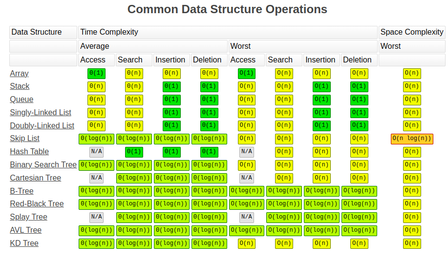
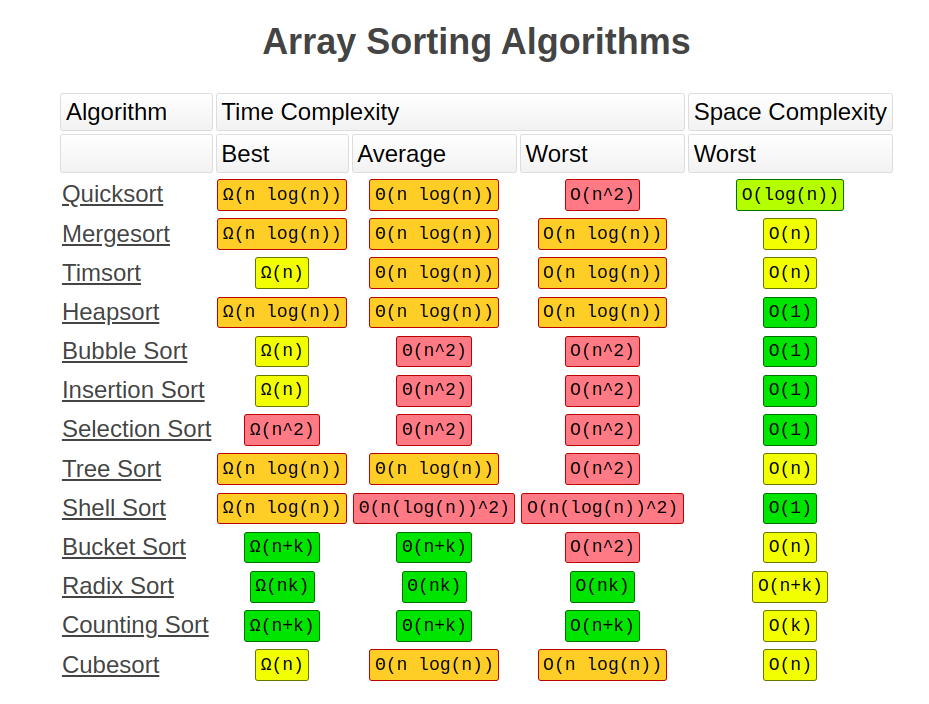

# Big O

## Khái niệm cơ bản về Big O

### 1. O(1): Thời gian hằng số ( Constant Time)

1. Đặc điểm: Không phụ thuộc vào kích thước cuả tập dữ liệu.
2. Ví dụ: Truy cập một phần tử trong mảng bằng chỉ số (index)

### 2. O(log n): Thời gian Logarit

1. Đặc điểm: chia đôi dữ liệu ở mỗi bước ( kỹ thuật divide and conquer - `chia để trị`)
2. Ví dụ: Thuật toán **binary search** (tìm kiếm nhị phân)

### 3. O(n): Thời gian tuyến tính (Linear Time)

1. Đặc điểm: Tỷ lệ thuận với kích thước của tập dữ liệu.
2. Ví dụ: Duyệt qua tất cả các phần tử trong một mảng bằng vòng lặp

### 4. O(n log n): Thời gian Tuyến tính nhân Logarit (Linearithmic Time)

1. Đặc điểm: Vừa chia nhỏ vừa sắp xếp hoặc tìm kiếm dữ liệu.
2. Ví dụ: Các thuật toán sắp xếp như **merge sort**, **quick sort**.

### 5. O(n^2): Thời gian Đa Thức (Polynomial Time)

1. Đặc điểm: Vòng lặp lồng nhau cho mỗi lũy thừa của n.
2. Ví dụ: Thuật toán **bubble sort** có độ phức tạp **O(n^2)**

## Các Ký Hiệu Đánh Giá Độ Phức Tạp

### 1. Omega (Ω) - Cận Dưới (Lower Bound)

1. Ý nghĩa: Mô tả trường hợp tốt nhất **(best-case scenario)** cho một thuật toán.
2. Nói đơn giản: Cho biết thời gian chạy nhanh nhất của thuật toán trong điều kiện lý tưởng.

### 2. Theta (Θ) - Cận Giữa (Tight Bound)

1. Nói đơn giản: Cho biết `thời gian chạy trung bình` (average-case) của thuật toán, phản ánh `thời gian phổ biến nhất` khi thực hiện.

### 3. Big O (O) - Cận Trên (Upper Bound - Worst Case)

1. Ý nghĩa: Mô tả trường hợp xấu nhất (worst-case scenario) cho một thuật toán.
Nói đơn giản: Cho biết thời gian chạy chậm nhất của thuật toán trong điều kiện tệ nhất.

## Mẹo Hữu Ích Khi Phân Tích Độ Phức Tạp

1. Xem Xét Cả 3 Trường Hợp: Tốt Nhất, Trung Bình, Xấu Nhất
Đừng chỉ tập trung vào worst-case, hãy xem xét cả best-case và average-case.
2. Bỏ Qua Các Thành Phần Không Chi Phối (Non-Dominant Terms)
Ví dụ: Đối với O(n² + n), chỉ cần tập trung vào O(n²) vì khi n lớn, n² sẽ chi phối.
3. Bỏ Qua Hằng Số (Drop Constants)
Ví dụ: O(2n) đơn giản hóa thành O(n) vì các hằng số không ảnh hưởng nhiều khi n lớn.

## Mảng

1. luôn phải cập nhật lại `index` khi `thêm` hoặc `chèn` vào `đầu mảng` hoặc `đâu đó trong mảng` (ngoại trừ cuối cùng) => O(n) là wrost-case.

## Bảng Tóm tắt Độ phức tạp thuật toán

