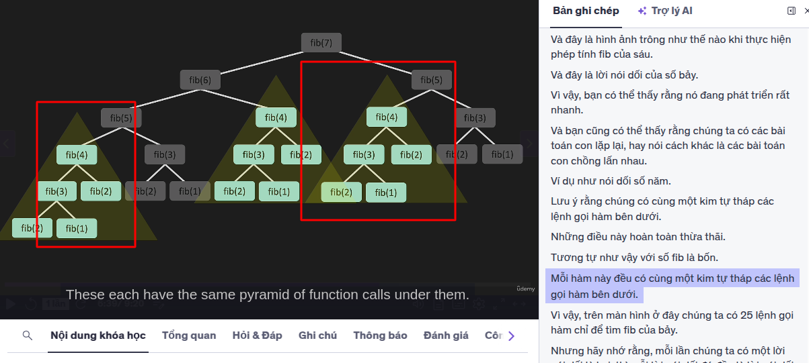
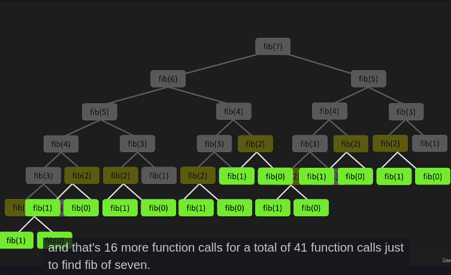
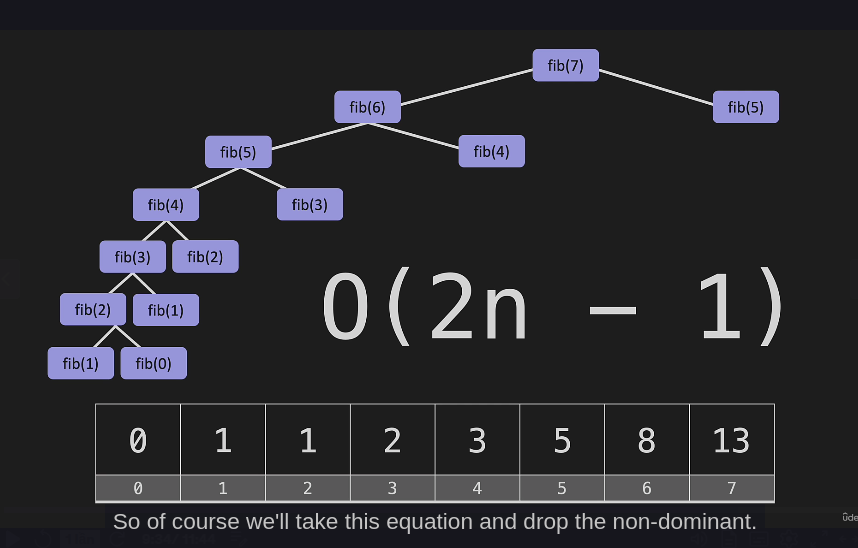

# Dynamic Programming

- Quy hoạch động là 1 phương pháp được sử dụng trong toán học và khoa học máy tính để giải quyết các vấn đề phức tạp bằng cách chia chúng thành các bài toán con đơn giản hơn. Bằng cách giải mỗi bài toán con chỉ một lần và lưu trữ kết quả, nó tránh được các phép tính dư thừa đẫn đến giải pháp hiệu quả hơn cho nhiều bài toán.
- là một kỹ thuật trong lập trình dùng để giải quyết các bài toán có tính chất chồng lặp `(overlapping subproblems)` và cấu trúc con tối ưu `(optimal substructure)` bằng cách lưu lại `(memoize)` hoặc xây dựng dần `(tabulation)` lời giải của các bài toán con, tránh việc tính toán lặp đi lặp lại.

## Quy hoạch động (DP) hoạt động như thế nào?

### Nguyên lý hoạt động của DP

1. Chia bài toán thành các bài toán con nhỏ hơn: Bài toán ban đầu được chia thành các bài toán con mà mỗi bài toán con là 1 phần của bài toán lớn hơn. Các bài toán con này thường có tính chất lặp lại.
2. Lưu trữ kết quả của các bài toán con: Để tránh việc tính toán lặp lại các bài toán con nhiều lần kết quả của chính được lưu trữ trong 1 bảng (thường là mảng hoặc ma trận)
3. Sử dụng lại kết quả đã lưu: Khi cần kết quả của 1 bài toán con nào đó, chương trình sẽ kiểm tra bảng lưu trữ để xem kết quả đã được tính toán trước đó chưa. Nếu đã có, nó sẽ sử dụng lại kết quả đó thay vì tính toán lại từ đầu.

### Các bước thực hiện

1. Xác định cấu trúc của bài toán con tối ưu
2. Định nghĩa hàm hồi quy: Xác định công thức hoặc hàm hồi quy để giải quyết bài toán dựa trên các bài toán con.
3. Tính giá trị của bài toán con theo thứ tự từ nhỏ đến lớn
4. Lưu trữ kết quả của các bài toán con
5. Giải quyết bài toán lớn nhất: Sau khi đã tính toán và lưu trữ kết qủa của tất cả các bài toán con, sử dụng chúng để giải quyết bài toán ban đầu

### Khi nào thì dùng thuật toán quy hoạch động

- Bài toán có các bài toán con gối nhau
- Bài toán có cấu trúc con tối ưu

💡 Các bài toán nổi bật dùng DP:

- Bài toán cái túi (Knapsack)
- Dãy con chung dài nhất (Longest Common Subsequence - LCS)
- Dãy con tăng dài nhất (Longest Increasing Subsequence - LIS)
- Đếm số cách đi cầu thang (Staircase problem)
- Bài toán đường đi ngắn nhất trong lưới (Grid path problems)
- Biến đổi xâu (Edit distance)

=> Quá trình lưu trữ kết quả cho các bài toán con được gọi là `Memoization`

### 🧰 Hai phương pháp chính

1. Top-down (Memoization): Dùng đệ quy + lưu kết quả các bài toán con.
   - Code đơn giản, dễ hiểu.
   - Có thể gây tràn stack nếu đệ quy sâu.

2. Bottom-up (Tabulation): Dùng vòng lặp để tính dần các kết quả từ dưới lên.
   - Tiết kiệm bộ nhớ hơn, tránh đệ quy.
   - Thường nhanh hơn một chút.

| Điều kiện               | Ý nghĩa                          | Mục tiêu khi dùng DP                |
|-------------------------|----------------------------------|-------------------------------------|
| Overlapping Subproblems | Các bài toán con bị lặp lại      | Lưu trữ để không tính lại           |
| Optimal Substructure    | Bài toán lớn xây từ bài toán con | Giải từ dưới lên hoặc đệ quy có lưu |

### Yêu cầu cốt lõi DP:

#### Overlapping Subproblems

📌 Định nghĩa:
Là khi bài toán ban đầu có thể chia thành nhiều bài toán con nhỏ hơn, và các bài toán con này lặp đi lặp lại nhiều lần trong quá trình giải.

📋 Ví dụ:
Bài toán Fibonacci:

  ```javascript
    fib(5) = fib(4) + fib(3)
       = (fib(3) + fib(2)) + (fib(2) + fib(1))
  ```

👉 fib(2) bị tính nhiều lần
✅ Ý nghĩa:

- Thay vì tính lại từ đầu mỗi lần, ta lưu kết quả các bài toán con đã giải -> giúp tăng tốc độ đáng kể
- 

#### Optimal Substructure (Cấu trúc con tối ưu)

📌 Định nghĩa:
Là khi lời giải của bài toán lớn có thể xây dựng từ lời giải tối ưu của các bài toán con.
📋 Ví dụ:
Bài toán Tìm đường đi ngắn nhất từ A đến C qua B:

Nếu đường đi ngắn nhất từ A → C là qua B,

Và ta đã biết đường đi ngắn nhất từ A → B và từ B → C,
→ Thì lời giải tổng là tối ưu nếu các đoạn con cũng tối ưu.

##### ✅ Ý nghĩa

- Giúp ta xây dựng lời giải bài toán lớn từ các lời giải nhỏ hơn, mà không cần xét lại tất cả tổ hợp.

## Giải bài toán fibonaci

1. Bài toán fib có:
   - ✅ CÓ thể chia nhỏ thành các bài toán con
     - 👉 Fibonacci:
       - Để tính fib(n), ta cần fib(n-1) và fib(n-2). Tức là: `fib(n) = fib(n-1) + fib(n-2)`
   - ✅ Có tính chất chồng lặp (overlapping subproblems)
     - Khi tính `fib(5)`, ta phải tính `fib(4) và fib(3)`.Nhưng `fib(4)` lại cần `fib(3) và fib(2)` → `fib(3)` bị tính `lặp lại nhiều lần`.
   - ✅ Có tính chất con tối ưu (Optimal Substructure)
     - Rõ ràng `fib(n)` phụ thuộc trực tiếp vào `fib(n-1) và fib(n-2)` –> tức là lời giải con được tái sử dụng nguyên vẹn.
2. ví dụ
   - 

3. Độ phức tạp thuật toán
   1. `Đối với đệ quy thông thường`:
      - Mỗi bài toán con lại có 2 bài toán nhỏ được gọi => giống như cây nhị phân
      - Độ phức tạp thời gian (Time Complexity): `O(2^n)`
      - Độ phức tạp không gian (Space Complexity): `O(n)` do chiều sâu của stack khi đệ quy

## Các kỹ thuật cache phổ biến

### Memoization

- là 1 kỹ thuật để lưu trữ kết quả các bài toán con đã tính, nhằm tránh tính lại chúng khi lặp lại.
- Nó thường được áp dụng với đệ quy, giúp giảm tốc độ phức tạp thời gian từ cấp số nhân xuống tuyến tính hoặc đa thức.
- Sau khi memoization: 

### 🔥 1 số kỹ thuật khác

| Kỹ thuật          | Áp dụng chính                      |
|-------------------|------------------------------------|
| `Memoization`     | `Hàm đệ quy, tính toán thuật toán` |
| `In-memory`       | `Backend cache tạm`                |
| `LocalStorage`    | `Frontend settings, token`         |
| `HTTP Cache`      | `Tối ưu tải tài nguyên web`        |
| `Redis/Memcached` | `Cache phân tán quy mô lớn`        |

### 📌 Chiến lược cache phổ biến

| Chiến lược         | Mô tả                                                             |
|--------------------|-------------------------------------------------------------------|
| **Cache-aside**    | App tự kiểm tra cache → không có thì lấy từ DB rồi ghi vào cache. |
| **Write-through**  | Mỗi khi ghi vào DB → đồng thời ghi vào cache.                     |
| **Write-back**     | Ghi vào cache trước → đồng bộ về DB sau.                          |
| **Time-based TTL** | Cache tự động hết hạn sau một khoảng thời gian.                   |
| **LRU Cache**      | Loại bỏ phần tử ít được dùng gần đây nhất khi hết dung lượng.     |
