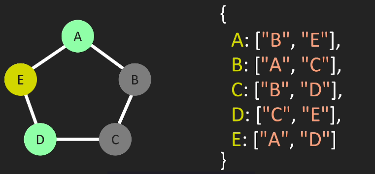
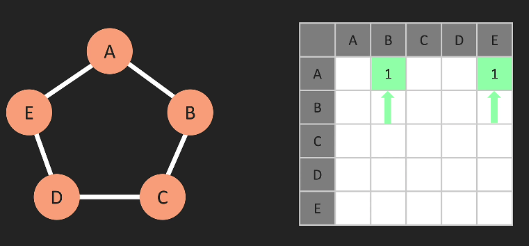
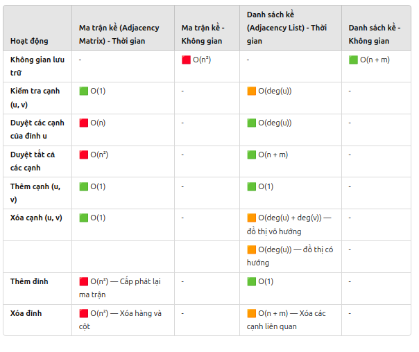

# GRAPHS

- Thường sử dụng để biểu diễn các mối quan hệ giữa các đối tượng
- 1 graphs có 2 phần:
  - **Vertex (Đỉnh):** Đại diện cho các đối tượng hoặc nút trong đồ thị. Đôi khi còn gọi là `"node"`.
  - **Edge (cạnh):** Đại diện cho mối quan hệ hoặc liên kết giữa các đỉnh. Cạnh có thể có hướng `(directed)` hoặc không có hướng `(undirected)`

## Phân loại đồ thị:

1. Đồ thị có hướng (directed graph): Các cạnh có hướng xác định từ 1 đỉnh này sang đỉnh khác.
   1. ví dụ: Mạng xã hội với quan hệ "follow" trên Instagram
2. Đồ thị vô hướng (Undirected Graph): các cạnh không có hướng, nghĩa là quan hệ giữa hai đỉnh là hai chiều.
   1. Ví dụ: Mạng xã hội với quan hệ "kết bạn" trên Face
3. Đồ thị trọng số (Weighted Graph): Các cạnh có trọng số kèm theo, thường dùng để biểu diễn độ dài, chi phí hoặc trọng số giữa các đỉnh.
   1. ví dụ: Bản đồ đường đi với khoảng cách giữa các thành phố
4. Đồ thị vô hướng có trọng số (Weighted Undirected Graph): Đồ thị không có hướng nhưng có trọng số trên các cạnh
   1. Ví du: Mạng lưới điện với các trạm phát và chi phí truyền tải.

## Ứng dụng của đồ thị

1. Mạng máy tính: Biểu diễn các kết nối mạng.

2. Đường đi ngắn nhất: Tìm đường đi ngắn nhất trong bản đồ (thuật toán Dijkstra).

3. Lập lịch: Biểu diễn và giải quyết các vấn đề lên lịch công việc (sử dụng đồ thị có hướng).

4. Mạng xã hội: Biểu diễn quan hệ bạn bè, người theo dõi.

5. Phân tích web: Biểu diễn liên kết giữa các trang web (sử dụng đồ thị có hướng).

## Các khái niệm cơ bản về Graphs

- `Đỉnh (Vertex)`: Điểm nối trong đồ thị. Tập hợp đỉnh được ký hiệu là V.

- `Cạnh (Edge)`: Mối liên kết giữa hai đỉnh. Tập hợp cạnh được ký hiệu là E.

- `Bậc của đỉnh (Degree)`: Số cạnh nối vào một đỉnh.

- `Đồ thị có hướng (Directed Graph)`: Cạnh có hướng từ đỉnh này sang đỉnh khác.

- `Đồ thị vô hướng (Undirected Graph)`: Cạnh không có hướng, đi từ cả hai phía.

## 2. Các phương pháp biểu diễn đồ thị

1. `Danh sách kề (Adjacency List)`: Dùng mảng hoặc danh sách liên kết để lưu các đỉnh kề của mỗi đỉnh. Hiệu quả khi đồ thị thưa.
   1. biểu diễn key: [value]
   2. 
   3. trong đó: key là đỉnh, value là các đỉnh kề nó

2. `Ma trận kề (Adjacency Matrix)`: Dùng ma trận 2 chiều n x n với n là số đỉnh. Thích hợp khi đồ thị dày đặc.
   1. 

## Big O of Graphs

- Danh sách kề thì mỗi đỉnh i, lưu danh sách các đỉnh j mà có cung hướng từ i đến j.
- Với ma trận kề chúng ta lưu trữ mọi thứ mà A kết nối tới và không kết nối tới
- `=> Điều này làm cho ma trận kề trở nên kém hiệu quả khi xét đến độ phức tạp của không qian`.

- Với ma trận kề ta mất O(n^2) không gian
- Với danh sách kề ta mất O(n + m) không gian. Với m là số cạnh, n là đỉnh
- 

## Khi nào nên dùng

1. Ma trận kề: Đồ thị dày đặc, nhiều cạnh. Cần truy xuất nhanh giữa các đỉnh.

2. Danh sách kề: Đồ thị thưa, linh hoạt trong việc thêm hoặc xóa đỉnh và cạnh.