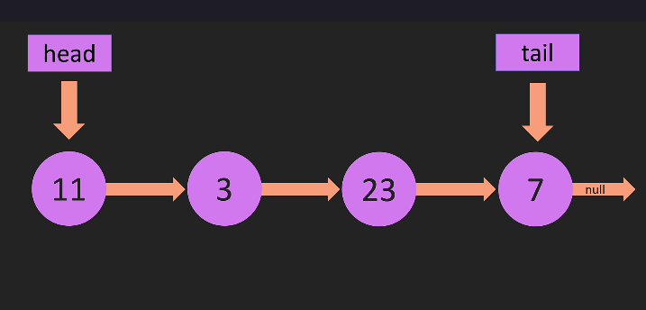
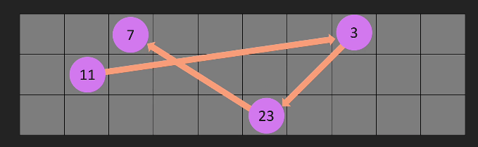
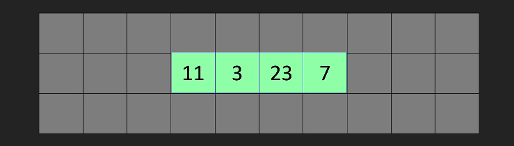
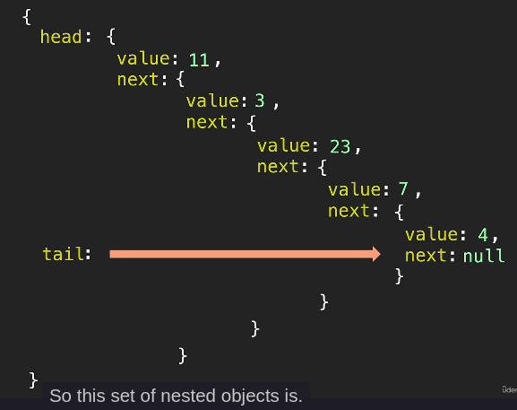

# LINKED LISTS

1. Linked lists không có `index` còn mảng thì có
2. Mảng đặt ở vị trí **liền kề** trong bộ nhớ còn linked list thì không (chúng ở khắp mọi nơi trong bộ nhớ)
3. Linked list có 1 biến gọi là `head` trỏ đến `đối tượng đầu tiên`, `tail` trỏ tới `đối tượng cuối cùng`. Sau đó mỗi đối tượng trong danh sách được liên kết trỏ đến đối tượng tiếp theo, `đối tượng cuối cùng` sẽ trỏ tới `null` (**null terminated list**)
   1. 
   2. 
   3. 

## BIG O LINKED LISTS

1. singly linked lists thì có 2 phần là `data` và `con trỏ next`
2. còn doubly thì có 3 là `data`, `next`, `prev` ( trỏ tới nút trước)  
3. Add 1 node vào `đầu hoặc cuối` danh sách liên kết ta chỉ cần `head hoặc tail` trỏ tới node đó là được => O(1)
4. Xóa 1 node ở `cuối danh sách` liên kết ta phải duyeejttuwf đầu để tìm phần tử trước phần tử cuối cùng rồi trỏ tới null. => O(n)
   1. Nếu là danh sách liên kết đôi (có thêm prev) thì chỉ cần trỏ tail.prev = null => O(1)
5. Xóa 1 node ở đầu thì chỉ cần trỏ head tới con trỏ tiếp theo. Chức năng thu gom rác của js, java, python sẽ làm việc với con trỏ cũ khi nó không được biến nào tham chiếu tới nữa.
6. Sơ đồ danh sách liên kết đơn trong JS
   1. 