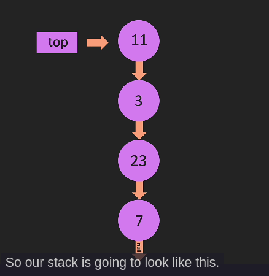

# STACK

- vào trước ra sau thì là `stack`.(List In, First Out)
- Chỉ truy cập phần tử trên cùng (O(1))
- Thêm xóa ở cuối (O(1))
- không áp dụng thêm xóa ở `đầu và giữa`
- chỉ lưu dữ liệu.
- Dùng Stack khi:
  - `Cần thao tác với LIFO, như Undo/Redo, Backtracking, kiểm tra dấu ngoặc đúng sai.`

1. Triển khai Stack với linked list:

   - Như ta đã biết thì khi thêm/xóa ở stack chỉ mất O(1).
   - Nếu ta dùng linked list theo chiều từ head -> tail như thông thường (dựng thẳng thì head ở cuối stack, tail ở đầu stack). Khi đó ta sẽ phải dùng push và pop để  thêm/ xóa. Mà pop mất O(n) cho nên => ta phải dựng từ trên xuống dưới như sau:
     - 