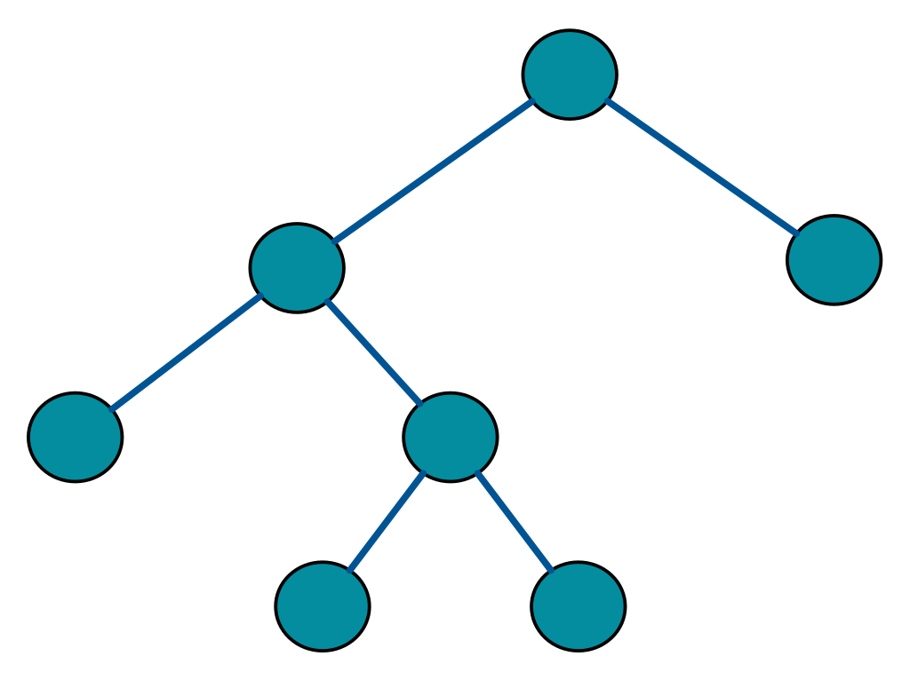

# Trees

1. Cây thì có thể có nhiều con
2. Mỗi con chỉ có duy nhất 1 nút cha
3. không có chu trình trong cây

## Cây nhị phân

1. Cây nhị phân (Binary Tree) bản chất là 1 danh sách liên kết và có 2 con trỏ left và right
2. Nút không có bất kỳ node con nào gọi là node lá
3. có 1 số kiểu cây nhị phân:
   1. `Cây nhị phân đầy đủ`: là câu mà mỗi nút có thể  0 hoặc 2 nút con
      1. 
   2. `Cây nhị hoàn hảo`: là cây mà tất các nút bên trong đều có 2 nút con và tất cả các nút lá đều có cùng độ sâu hoặc cùng cấp
   3. `Cây nhị phân hoàn chỉnh`: một cây nhị phân mà mọi mức (trừ mức cuối cùng) đều được điền đầy đủ từ trái sang phải. Mức cuối cùng có thể chưa đầy nhưng các node vẫn phải điền từ trái qua phải, không được bỏ trống ở giữa.

      ```markdown
                  1
                /   \
               2     3
              / \    /
              4  5  6
      ```

    ☑️ Cây trên là một cây nhị phân hoàn chỉnh, vì:
      - Mọi mức trừ mức cuối cùng đều đầy đủ.
      - Ở mức cuối cùng, các node được điền từ trái qua phải (4, 5, 6), không có khoảng trống giữa.
    ⚠️ Ví dụ về cây KHÔNG phải nhị phân hoàn chỉnh

      ```markdown
             1
            / \
           2   3
          /     \
         4       6
      ```

      🚫 Cây trên KHÔNG phải nhị phân hoàn chỉnh, vì node 5 bị thiếu nhưng node 6 vẫn có mặt ở bên phải. Điều này vi phạm quy tắc "điền từ trái qua phải".

## Cây nhị phân tìm kiếm (Binary Search Tree)

1. Các nút `bên trái` luôn `nhỏ hơn` nút gốc
2. Các nút `bên phải` luôn `lớn hơn` nút gốc

### 1. Độ phức tạp trung bình (Average Case)

- Trong 1 BST `cân bằng`, số phần tử theo cấp số nhân ( ~ 2^n - 1)
- Nếu có N phần tử, chiều cao của BST ~ log(N)
- Khi đó, các thao tác đều có độ phức tạp trung bình là 0(N)

| Operation | Time complexity (Balanced BST) |
|-----------|--------------------------------|
| Lookup    | O(log N)                       |
| Insert    | O(log N)                       |
| Remove    | O(log N)                       |

### 2. Độ phức tạp xấu nhất (Worst Case)

- Nếu BST `bị mất cân bằng`, tức là các phần tử theo thứ tự `tăng` hoặc `giảm` dần, cây sẽ trở thành `Linked List`
- KHi đó các thao tác phải duyệt từ N phần tử -> O(N)

  ```markdown
    1
     \
      2
       \
        3
         \
          4
           \
            5
  ```

- Tìm kiểm 1 phần tử mất O(N)
- Chèn hoặc xóa cũng mất O(N) 